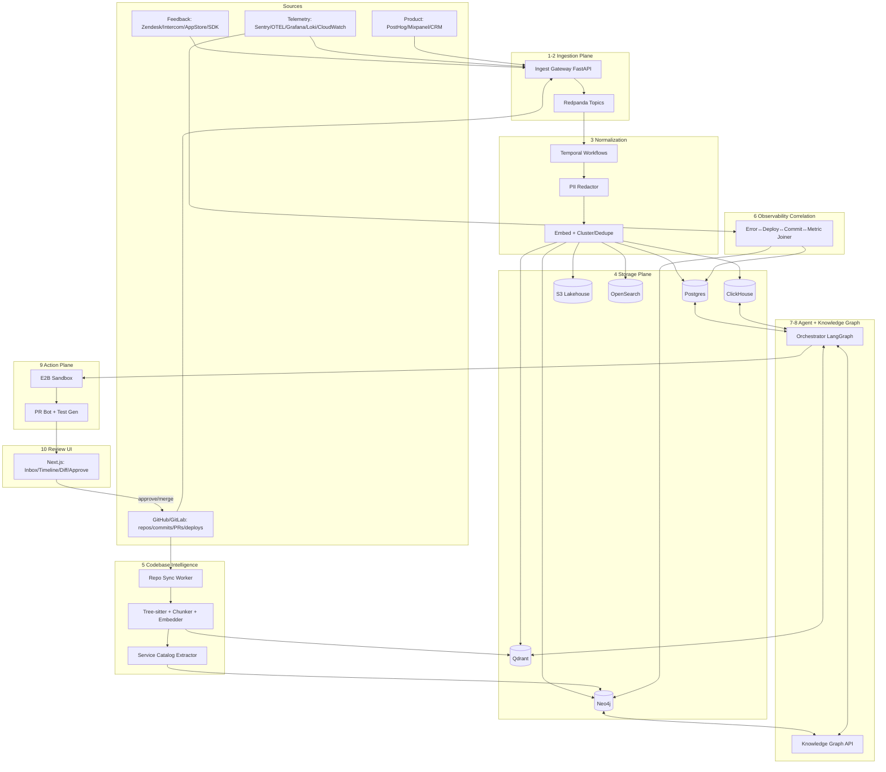

# Fusebox — System Architecture

> Autonomous AI engineering intelligence on top of an existing product.
> Ingests feedback + code + telemetry → investigates → proposes fix/PR/plan → human approves.

**Status:** v1.0 draft | **Autonomy target:** Draft PRs, human merges | **MVP slice:** Feedback + GitHub + Sentry/logs + Grafana

---

## 1. Goals / Non-Goals

**Goals:**
1. Prove full loop on one repo + one service: `feedback → cluster → root-cause → draft PR + tests`.
2. Ground every claim in evidence: code link + commit/deploy + log/trace/metric excerpt.
3. Multi-tenant SaaS from day one (even if first deploy is single-tenant).
4. Async, replayable, auditable. No black-box agent writes.

**Non-goals (v1):**
- Auto-merge to main, auto-deploy, auto-rollback.
- Full APM replacement (we correlate, Grafana/Datadog remain source of truth).
- Supporting every connector (start with 6, abstract the rest).

**Key differentiator:** not summarization. The system must answer: *what user felt → what happened in prod → where in code → why → how to fix + blast radius + verification.*

---

## 2. Design Principles

1. **Evidence-first:** every agent output has citations (code permalink, Sentry event id, Loki query, deploy id). No citation = low confidence.
2. **Async everything:** ingestion → queue → workflow. API never blocks on LLM.
3. **Polyglot storage, single tenant key:** Postgres is record; ClickHouse/Qdrant/Neo4j are projections. All rows keyed by `tenant_id`.
4. **Incremental, not batch:** webhook-driven re-index. Full re-index is failure mode.
5. **Small model triage, large model investigate:** cost control is architecture.
6. **Agent proposes, platform disposes:** sandbox + policy + human approval before any external write (PR, ticket, comment).
7. **Replayable:** raw events in S3 lakehouse (Parquet/Iceberg). Any projection can be rebuilt.

---

## 3. High-Level Architecture



Simplified request path (matches product vision):

```
Feedback / Tickets / Crash reports
↓ Ingestion (Gateway → queue → normalize → PII-strip)
↓ Codebase Knowledge (repos, AST, commits, deploys, service catalog)
↓ Agent (Triage → Cluster → Enrich → Hypothesize → Verify)
→ fan-out to: Code (GitHub) | Observability (Grafana/logs/traces) | Product (analytics)
↓ Root-cause investigation (timeline + confidence)
↓ Recommended action (fix diff / PR / plan / tests / prioritize)
↓ Human review & approval → Deployment → Post-deploy verification loop
```

---

## 4. Plane-by-Plane Spec

### 4.1 Integration Plane (connectors)

| Category | MVP connectors | Later | Mechanism |
|---|---|---|---|
| Code | GitHub App | GitLab, Bitbucket | OAuth + webhooks (`push`, `pull_request`, `deployment_status`) + read API |
| Feedback | Ingest API + CSV + Zendesk | Intercom, App Store, Play, Slack `#bugs` | Webhook → gateway; polling worker for backfill |
| Errors | Sentry | Crashlytics, Bugsnag | Webhook + API sync (issue/event) |
| Logs/Metrics/Traces | Loki/CloudWatch + Grafana API + OTEL | Datadog, Prometheus, Honeycomb | Query-time (MCP tool) + selected tail persisted to ClickHouse |
| Product | PostHog events (opt) | Mixpanel, Amplitude, Salesforce | Batch sync + query-time |
| Output | GitHub PR, Linear/Jira, Slack | Email, Notion | Action workers with per-tenant OAuth tokens |

Connector contract: every connector is a stateless worker: `validate → normalize to CanonicalEvent → publish`. New connector = new Temporal workflow + MCP read tool, no core changes.

### 4.2 Ingestion Plane

- **Gateway:** FastAPI, edge-validates HMAC/API key, enforces per-tenant rate limit (Redis token bucket), PII pre-scan, publishes to Redpanda, returns `202 {event_id}`.
- **Topics:** `feedback.raw.v1`, `code.events.v1` (push/pr/deploy), `telemetry.errors.v1`, `telemetry.signals.v1`, `product.events.v1`. Partition key: `tenant_id`. Retention 7d hot; infinite in S3.
- **Throughput targets (per tenant, MVP):** 500 feedback/d, 200 deploys/d, 50k error events/d sampled to 5k persisted. Platform target: 100 tenants on one Redpanda cluster (3 brokers) + scale by adding partitions/consumers.
- **Failure:** DLQ topic + S3 quarantine. Poison events never block partition (skip + alert after 5 retries with backoff).

### 4.3 Normalization + Entity Resolution

Temporal workflow `ingest.v1`:
1. `redact_pii` (regex + small NER model; emails/phones/tokens → `[REDACTED]`; raw kept only in encrypted S3 if tenant opts in, default off).
2. `normalize` → CanonicalEvent `{tenant_id, source, type, occurred_at, actor_hash, title, body, urls, app_version, os, service_hint}`.
3. `embed` (e.g. `bge-small` / OpenAI `text-embedding-3-small`; 768–1536d) → Qdrant.
4. `cluster`: nearest-neighbor + LLM confirm if similarity 0.72–0.88; auto-merge >0.88, new cluster <0.72. Prevents 500 "checkout crash" tickets → 1 `IssueCluster`.
5. `entity_resolve`: link `app_version → Deployment`, `stacktrace frames → CodeUnit`, `feature keywords → Feature`.

### 4.4 Storage Plane (why polyglot)

| Store | Holds | Partitioning / isolation | Why |
|---|---|---|---|
| Postgres 16 (RDS) | orgs, projects, connectors, feedback, clusters, investigations, actions, audit | RLS on `tenant_id`; read replicas | System of record, transactions |
| ClickHouse | error occurrences, log tails, metric samples, trace spans (sampled) | `PARTITION BY (tenant_id, toYYYYMM(occurred_at))`, TTL 90d hot → S3 | 10–100x cheaper than Postgres for telemetry scans |
| S3 + Parquet/Iceberg | raw payloads, full logs, replay source | `s3://lake/tenant_id/yyyy/mm/dd/*.parquet`, SSE-KMS per tenant | Rebuild anything |
| Qdrant | vectors: feedback chunks, code chunks, error signatures, docs | per-tenant collection `t_<id>_code`, `t_<id>_feedback` | Filtered ANN at scale |
| Neo4j | knowledge graph (Section 7) | per-tenant label prefix + separate DB per scale tier | Traversal queries no SQL can do |
| OpenSearch | full-text over feedback + code symbols | per-tenant index | Keyword + hybrid search |
| Redis | rate limits, idempotency keys, job locks, UI cache | key prefix `t:<id>:` | Ephemeral |

Rebuild rule: Postgres + S3 can regenerate Qdrant/Neo4j/ClickHouse. Vectors/graph are caches with lineage.

### 4.5 Codebase Intelligence Plane

Pipeline on `push` webhook (not cron):
1. **Sync:** shallow fetch diff only (`--depth 50` + target commit). Monorepo-aware: only changed paths. Clone cache on EFS/EBS per tenant+repo.
2. **Parse:** Tree-sitter per language → `CodeUnit {file, lang, symbol, kind(func/class/endpoint/migration), start/end, imports, calls}`.
3. **Chunk:** 1 chunk per function + 1 per 200-line file spillover; keep header context (package, class docstring). Store `{content, ast_sig, embedding}`.
4. **Service catalog extraction (LLM-assisted, cached):** from manifests (`package.json`, `Dockerfile`, `k8s/*.yaml`, `openapi.*`, Prisma/schema): services, routes, tables, queues, deps. Written to Neo4j, refreshed on manifest change only.
5. **Commit/PR/deploy linking:** `Commit {sha, author, msg, files}` → `PR {id, diff_stat}` → `Deployment {id, env, version, time}`. Blame available as MCP tool (no full history in vector store).

Scale tricks: ignore `node_modules/dist/*.min.js` via `.pilignore` (defaults + tenant override); embed only changed chunks; delete vectors for deleted files; cap initial import at 500k chunks/repo (larger needs sharded collection).

> **Implemented (Phase 1, local-first):** `workers/indexer/pil_indexer/` — stdlib-`ast` Python chunking + heuristic TS/JS/Go/SQL, deterministic hash embeddings (sublinear TF), hybrid search (cosine + IDF-weighted coverage + symbol boost), content-hash incremental sync, JSONL store per tenant/repo. Served via `POST /v1/repos/sync`, `GET /v1/repos`, `GET /v1/code/search`, `POST /v1/webhooks/github`, and consumed by agent `code_search`/`code_read` when `PIL_INDEX_ROOT` is set. Qdrant + Tree-sitter + OpenAI embeddings slot behind the same `chunk/embed/upsert/search` interface later.

### 4.6 Observability Correlation Plane

Join keys: `service + version/commit + time window + error signature`.

- Error ingest: Sentry webhook → canonical `ErrorGroup {fingerprint, service, release, first_seen, count}` → ClickHouse occurrences.
- Deploy proximity check: for each `IssueCluster` spike, query deploys in `[spike_start-6h, spike_start]` for same service. Score boost if overlap.
- Metric check (query-time, not persisted all): MCP `metrics.query(service, metric=p99/errors, window)` hits Grafana/Prom API; persists only the returned window to ClickHouse as evidence.
- Log/trace check: MCP `logs.query(service, window, filters)` (Loki/CW) + `traces.sample(error_id)` (OTEL). Persist top-20 spans as investigation attachments.
- Anomaly (v1 simple): z-score on per-service error rate vs prior 7d same-hour. v2: Prophet/IsolationForest offline job.

> **Implemented (Phase 2, local-first):** Postgres `deployments` / `error_groups` / `error_occurrences` (+ memory fallback, RLS) instead of ClickHouse; Sentry webhook + batch import; `workers/correlation` pure joiner behind `GET /v1/correlate`; agent `deploys_list`/`errors_recent` read the live gateway via `agent/platform.py` when configured. Grafana/Loki stay query-time stubs until tenant creds land; ClickHouse replaces the occurrences table at scale with the same row shape.

### 4.7 Knowledge Graph Plane

See Section 7. Graph is updated by workers (deterministic edges: `DEPLOYED_IN`, `INTRODUCED_BY`) + agent (hypothesis edges marked `confidence`, `created_by=agent`, never overwriting deterministic edges).

> **Implemented (Phase 3, local-first):** `workers/graph` — same node/edge schema (`cluster`, `feedback`, `error_group`, `deployment`, `code_unit`, `service`), file-backed JSON per tenant, `neighbors()` instead of Cypher, `timeline()` ordering reports→errors→deploys→code→hypotheses. Neo4j replaces `save`/`load` later; served via `POST /v1/graph/rebuild` + `GET /v1/graph/timeline`.

### 4.8 Agent Plane

**Agentic framework (locked): LangChain + LangGraph.** LangChain for tools/prompts/chat models (`workers/agent/agent/tools.py`, `prompts.py`), LangGraph StateGraph for the orchestrator (`workers/agent/agent/graph.py`, nodes `triage → enrich → hypothesize → verify → plan`). State persisted in Postgres (`investigations` table = checkpoints). Each node is a Temporal activity (retryable, timeout-bounded). Model routing via LangChain chat models (mini for triage, sonnet/4o for hypothesis; see `agent/service.py::make_llm`).

```
TRIAGE (haiku/4o-mini) → CLUSTER_CHECK → ENRICH (tools) → HYPOTHESIZE (sonnet/4o) → VERIFY (tools+code exec) → PLAN → PATCH (sandbox) → TESTGEN → PRIORITIZE → AWAIT_APPROVAL
```

Subagents (single responsibility, separate prompts + evals):
- **Triage:** severity guess, PII check, needs-more-info?
- **Investigator:** builds timeline, proposes 1–3 hypotheses with confidence + contradictory evidence.
- **Coder:** produces unified diff only; must reference exact file+lines; runs in sandbox (`pytest`/`tsc`/`eslint` subset).
- **QA:** generates repro steps + new test cases (given failing trace), estimates regression risk via graph fan-out.
- **Product analyst:** aggregates "feature request" clusters into proposals (problem, cohorts, impact).
- **Prioritizer:** scores (Section 8), never reorders silently — shows math.

**MCP tools (agent-only, scoped by tenant):** `code.search`, `code.read`, `code.blame`, `graph.query`, `metrics.query`, `logs.query`, `traces.get`, `deploys.list`, `issues.list`. All tools log `{investigation_id, args, latency, rows}` to audit.

**Grounding rules:** max 8k tokens retrieved context per step (top-k code 8 + feedback 5 + telemetry 5); citations required; if tools return empty → agent must say "insufficient evidence" not hallucinate.

### 4.9 Action Plane

1. Sandbox (E2B/Daytona Firecracker): apply diff → install deps (cached layers) → run targeted tests/lint → capture output. No network except allowlisted registries. 10-min timeout, kill after.
2. PR Bot: opens **draft** PR on tenant repo via GitHub App installation token: title `[Fusebox] <issue>: <hypothesis>`, body = root cause + evidence links + risk + tests. Branch `fuse/<cluster-id>-<shortsha>`. Never pushes to `main`.
3. Ticket sync: Linear/Jira/Slack mirror with status `proposed → approved → merged → verified`.
4. Guardrails: denylist paths (`migrations/*`, `infra/*`, `auth/*` require explicit human checkbox), max diff 500 lines, secrets scan (gitleaks) before push.

> **Implemented (Phase 4, local-first):** `workers/action` — stdlib unified-diff parse/validate/apply, secret scan (blocks pre-write), temp-dir sandbox (`py_compile` + explicit checks, timeout, audit logs), risk score (fan-out from the code index + sensitivity + size, two-approval gate), GitHub draft-PR sequence (real behind `PIL_GITHUB_TOKEN`, dry-run artifact otherwise). Served via `POST /v1/actions/propose`, `POST /v1/actions/{id}/approve`; UI at `/actions`. E2B/Firecracker replaces `sandbox.py` later (known gap: no network isolation locally).

### 4.10 Human Review UI (Next.js)

Screens: `Inbox (clusters)` → `Investigation (timeline: reports ↔ errors ↔ deploys ↔ code)` → `Fix (diff + sandbox logs + risk)` → `Approve (merge / request changes / reject)` → `Verify (post-deploy error delta)`.
Every screen shows confidence + "why" (score breakdown) + one-click links back to Sentry/Grafana/GitHub. Keyboard-first triage (`A` approve, `R` request changes).

---

### 4.11 Business Context Plane (post-benchmark; see `docs/BUSINESS_LAYER_PLAN.md`)

Feeds the wedge, doesn't replace it: reorders which clusters get investigated
and adds a "why this matters" section to investigations/PRs.

1. **Goals:** per-tenant `goals.yaml` (north-star, weighted revenue-linked funnels,
   guardrails). Pure parse/validate lib; invalid configs fail closed, unmapped
   services get weight 0 with a visible flag — never silent defaults.
2. **Analytics ingest:** PostHog connector first (funnels + events), same webhook/
   backfill pattern as Sentry. `funnel_events` table (Postgres now, ClickHouse-shape
   + 90d TTL later, RLS).
3. **Joiner:** correlation lib extended with `funnel_step + time window` keys —
   drop-off steps link to error groups, latency deltas, deploys, ticket clusters.
4. **Impact estimator:** pure function → statements with stated uncertainty;
   unattributable impact renders `"unquantified"`, never fabricated `$`.
5. **Opportunity stream:** §8 score + explicit `goals.yaml` business-weight term,
   read-only ranking until wedge kill bars pass.
6. **Watcher:** scheduler over existing endpoints + dedupe + Slack digest.

---

## 5. Recommended Tech Stack

| Layer | Pick | Why | Alternative |
|---|---|---|---|
| API/workers | Python 3.12 FastAPI + Temporal | Best LLM + AST ecosystem | NestJS + Inngest |
| Orchestrator | LangChain + LangGraph (`workers/agent`) | Tools + prompts + checkpointed StateGraph; model swap via chat models | CrewAI (less control) |
| UI | Next.js 14 (Vercel) + Tailwind + shadcn | Speed | Remix |
| Queue | Redpanda (Kafka API) | Single binary, cheaper than MSK | Upstash Kafka |
| Workflow | Temporal Cloud/self-host | Durable agent steps | Trigger.dev |
| OLTP | Postgres 16 RDS + Drizzle/Prisma | RLS, pgvector fallback | Neon |
| Telemetry | ClickHouse Cloud | Cost/scan speed | Timescale |
| Vectors | Qdrant Cloud | Filtering + tenant collections | pgvector (smaller scale) |
| Graph | Neo4j Aura/self-host | Cypher traversals | Memgraph |
| Search | OpenSearch Serverless | Hybrid search | Typesense |
| Sandbox | E2B / Daytona | Firecracker isolation | Self-host Firecracker |
| Infra | AWS (ECS Fargate + RDS + S3) + Terraform | Familiar, SOC2 path | Fly.io (simpler early) |
| Auth | Clerk | Org/RBAC out of box | Auth.js |
| Billing | Stripe metered | Usage-based seats+events | Lago |

LLM routing: triage/cluster `gpt-4o-mini / claude-haiku`, investigate/code `claude-sonnet / gpt-4o`, embeddings `bge-small` self-host or `text-embedding-3-small`. BYO-key option for enterprise later.

---

## 6. Data Model (essentials)

**Postgres (abridged):**
```sql
tenants(id, name, plan, kms_key_id);
projects(id, tenant_id, name, repo_urls, services);
connectors(id, tenant_id, type, config_enc, status);
feedback(id, tenant_id, source, external_id, title, body, actor_hash, app_version, occurred_at, embedding_id);
issue_clusters(id, tenant_id, title, fingerprint, count, severity, status);
cluster_members(cluster_id, feedback_id, similarity);
code_units(id, tenant_id, repo, path, symbol, lang, chunk_hash, embedding_id);
commits(sha, tenant_id, repo, msg, author, committed_at);
deployments(id, tenant_id, service, version, commit_sha, env, deployed_at);
error_groups(id, tenant_id, fingerprint, service, first_seen, count);
investigations(id, tenant_id, cluster_id, status, confidence, timeline_json, created_by);
actions(id, tenant_id, investigation_id, type, diff_url, pr_url, status, risk_json);
audit_log(id, tenant_id, actor, action, args_json, created_at);
```

**ClickHouse:** `telemetry.events (tenant_id, ts, service, version, level, msg, trace_id, span_id, error_fingerprint)` — `ORDER BY (tenant_id, service, ts)`.

**S3:** `s3://pil-lake/<tenant>/<yyyy>/<mm>/<dd>/<topic>/<event_id>.json` + `code-snapshots/<repo>/<sha>.tar.zst` (shallow).

**Qdrant:** collections `t_<id>_feedback`, `t_<id>_code`, `t_<id>_errors`; payload `{pg_id, path, symbol, service, version, ts}`; HNSW `m=16, ef_construct=128`.

---

## 7. Knowledge Graph Schema

Nodes: `(:User)-[:REPORTED]->(:Feedback)-[:IN]->(:IssueCluster)-[:AFFECTS]->(:Feature)-[:IMPLEMENTED_BY]->(:Service)-[:CONTAINS]->(:CodeUnit)<-[:TOUCHED]-(:Commit)<-[:INCLUDES]-(:PR)-[:DEPLOYED_AS]->(:Deployment)-[:EMITS]->(:ErrorGroup)`, plus `(:MetricAnomaly)-[:CORRELATED_WITH]->(:IssueCluster)`, `(:Test)-[:COVERS]->(:CodeUnit)`.

Business-layer additions (post-benchmark): `(:FunnelStep)-[:STEP_EMITS]->(:Metric)`, `(:FunnelStep)-[:MEASURED_BY]->(:Service)`, `(:BusinessGoal)-[:WEIGHTS]->(:FunnelStep)`, `(:IssueCluster)-[:THREATENS]->(:FunnelStep)`, `(:Experiment)-[:TESTS]->(:FunnelStep)`. Same deterministic-edge discipline; file backend first, Neo4j later.

Deterministic edges from workers; hypothesis edges (`:LIKELY_CAUSED_BY {confidence, reason}`) from agent, TTL until human verdict.

Example:
```cypher
MATCH (c:IssueCluster {id:$cid})-[:AFFECTS]->(f:Feature)<-[:IMPLEMENTS]-(s:Service)
MATCH (d:Deployment {service:s.name}) WHERE d.ts > c.spike_start - duration('PT6H')
MATCH (d)<-[:DEPLOYED_AS]-(pr:PR)-[:INCLUDES]->(cm:Commit)-[:TOUCHED]->(u:CodeUnit)
MATCH (e:ErrorGroup)-[:EMITTED_BY]->(s) WHERE e.spike_start = c.spike_start
RETURN s, d, cm, u, e ORDER BY e.count DESC LIMIT 10
```

---

## 8. Prioritization + Confidence

**Priority:** `score = 0.3*severity(1-5) + 0.25*log10(1+count) + 0.25*biz_impact(0-1 from plan/ARR tag + affected paid cohort) + 0.2*confidence(0-1) - 0.15*effort(0-1 from diff size + risk)`. Show breakdown in UI; tenant-tunable weights. Post-benchmark, the Business Context Plane (§4.11) feeds `biz_impact` from `goals.yaml` weights as an explicit, visible term.

**Confidence:** starts 0.5; +0.15 telemetry match, +0.15 deploy proximity, +0.1 blame strength, +0.1 multi-source agreement; −0.2 contradictory evidence, −0.3 no telemetry. `<0.55` → "needs info", never auto-draft-PR.

**Regression risk:** `risk = fan_out(touched CodeUnits, depth=2)/100 + service_criticality + migration_flag`. High risk → require 2 approvals + full test run in sandbox.

---

## 9. Security / Tenancy / Compliance

- Isolation: RLS everywhere; per-tenant Qdrant collections / Neo4j DBs at scale tier; KMS per tenant for S3 + connector secrets (AWS Secrets Manager).
- Auth: Clerk orgs, RBAC (`admin/dev/viewer`), GitHub App least-privilege (contents:read, PR:write on `fuse/*` only).
- PII: redact before embed; raw logs gated by `pii_access` role + audit; DPA + EU region option; retention 90d hot / 1y lake, tenant delete = hard delete job across all stores (S3 tombstones + vector/graph purge + vacuum).
- Supply chain: sandbox no egress, gitleaks + `npm audit` on generated diffs, SBOM for our own images, audit log immutable (append-only + S3 Object Lock).

---

## 10. Scalability + Cost

- Scale units: stateless gateway/workers on Fargate HPA (CPU + queue lag); Redpanda partitions by tenant; ClickHouse/Qdrant/Neo4j scale independently. 10 → 1000 tenants = add partitions + read replicas + sharded vector collections, no rewrite.
- Caching: embed cache by `chunk_hash`, LLM prompt cache for catalog extraction, Redis for hot clusters.
- Cost levers: sample telemetry (persist 10%), small-model first, cap investigation depth (max 12 tool calls), per-tenant monthly LLM/event budgets with graceful degrade (triage-only mode).
- Self-observability: OTEL on our own services → same ClickHouse; SLOs: ingest p95 <2s, investigation p50 <3min, sandbox success >85%.

---

## 11. Deployment Topology (AWS)

`Route53 → ALB → Fargate (gateway, workers, agent) + Temporal → RDS Postgres + ClickHouse Cloud + Qdrant Cloud + Neo4j + Redpanda (EC2/K8s) + S3 + Secrets + ECR`. Frontend on Vercel. IaC Terraform, envs `dev/staging/prod`, preview env per PR for UI only. Secrets never in images.

---

## 12. Risks

| Risk | Mitigation |
|---|---|
| Hallucinated root cause | Citations required + VERIFY step + confidence gate |
| Runaway LLM cost | Routing + budgets + depth cap + eval on tool-call count |
| Noisy clusters | Human merge/split + similarity threshold per tenant tuning |
| Repo too big / polyglot | `.pilignore` + incremental + language allowlist MVP (TS/Python/Go) |
| Telemetry cardinality explosion | Sampling + TTL + persist-only-evidence pattern |

---

## Glossary

- **IssueCluster:** deduplicated group of feedback + linked telemetry.
- **Investigation:** one agent run over a cluster with timeline + hypotheses.
- **Action:** proposed fix/PR/plan/test set awaiting approval.
- **Service catalog:** derived map of services/routes/tables from manifests + AST.
