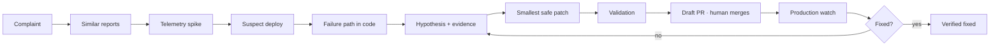

# ⚡ Fusebox

[](https://github.com/kushalsrinivas/fusebox/actions)
[](LICENSE)
[](apps/api)
[](apps/web)

### From user complaint to verified fix.

Fusebox connects customer feedback, production telemetry, deployments, and
source code to investigate real incidents — and produces evidence-backed fixes
a human approves. The whole loop, with receipts:



**Philosophy: autonomous investigation, controlled execution.** Fusebox runs
the entire detective loop on its own — ingest, correlate, hypothesize, patch,
test, monitor. Humans control the only two irreversible steps: **merge** and
**deploy**. That asymmetry is the product.

## The problem

A user writes: *"Checkout is broken."* Your team then manually walks:

```text
support inbox → Sentry → dashboards → GitHub → recent deploys →
code → reproduce → patch → test → deploy → watch → close the loop
```

That walk is the same every incident and it burns your best engineers' hours.
Fusebox does the walk.

## What a run looks like

Real output shapes from a local run (3 crash reports, 1 deploy, 1 Sentry spike):

**1. Similar reports detected** — 3 reports of *"checkout crash tapping pay"*
grouped into one cluster, majority service `payments-api`.

**2. Telemetry correlated** — Sentry error `capture failed: timeout`; the spike
starts 120 minutes after deploy `1.4.3`.

**3. Code investigated** — `apps/payments/checkout.py :: charge`, the capture
path touched by that deploy's commit.

**4. Hypothesis, with citations** — not a summary, a claim plus its evidence:

```json
{
  "status": "hypothesized", "confidence": 0.9, "severity": 4,
  "hypotheses": [{
    "title": "payments-api 1.4.3 (ab12) preceded spike",
    "citations": ["index://demo/apps/payments/checkout.py#L7-L14",
                  "pil://deployments/…", "pil://errors/…"] }],
  "repro_steps": ["Deploy 1.4.3 to staging", "…", "Observe: capture failed: timeout"]
}
```

No supporting evidence → no confidence: the system returns `needs_info`
instead of guessing.

**5–6. Patch proposed and validated** — a caller-supplied (or agent-written)
unified diff goes through policy check, secret scan, sandbox, and risk scoring:

```json
{ "status": "validated", "branch": "fuse/c_0-ab12",
  "risk": { "level": "low",
             "factors": ["sensitive area: apps/payments/checkout.py"] },
  "sandbox": { "levels": { "syntax": "passed", "tests": "not_run" } } }
```

**7–8. Draft PR, human merges** — `[Fusebox] checkout crash…` with root cause,
evidence links, risk reasons, and sandbox logs in the body. High-risk changes
need a second explicit confirmation. Fusebox never pushes to `main`.

**9–10. Production watched, loop closed:**

```json
{ "status": "verified_fixed", "groups": [{ "before": 5, "after": 0 }] }
```

Fresh approvals honestly report `inconclusive (too early)` until the window
elapses — a verifier that cries "fixed" on day zero is worse than none.

## Who it's for (and not for)

**Built for:** product engineering teams of roughly 5–30 shipping a web service
with GitHub, an error tracker (Sentry today), and versioned deploys. If your
incident workflow is "grep Slack, open Sentry, blame the last deploy," Fusebox
automates exactly that.

**Not ready for:** enterprise procurement. No SOC2, no SSO, no data-residency
controls, and — stated plainly below — no network isolation in the local
sandbox yet. If you need those checkboxes, watch this repo; don't deploy it.

## How it earns trust

| Mechanism | What it guarantees |
|---|---|
| Cited hypotheses | Every claim links a report, error, deploy, or code ref — or confidence stays low |
| Validation levels | `syntax` / `tests` report `passed`, `failed`, `skipped`, or `not_run` — never implied |
| Risk as reasons | `low/medium/high` always ships with factors (`sensitive area: …`, `fan-out: N`), never a bare number |
| Two-approval gate | High-risk changes require explicit second confirmation |
| Denylist + secret scan | `auth/`, `infra/`, migrations, and secrets block the pipeline before any external write |
| Audit log | Approvals, plan changes, and purges are recorded per tenant |
| Human merge | The agent proposes; only people merge and deploy |

## What Fusebox is not

- Not an observability replacement (Sentry/Grafana stay the source of truth).
- Not an autonomous coder (no auto-merge, no auto-deploy — see above).
- Not product analytics (feature-demand digest exists in the repo, but the
  wedge is **feedback → engineering resolution**, and everything orbits that).
- Not magic: the coder refuses to invent code without a model key, and
  investigations without evidence come back `needs_info`.

## The bet

Agents that read code are becoming commodity. What's scarce is **cross-system
causal context**: the linked record of *user → report → cluster → error →
telemetry → deploy → commit → code → fix → deploy → outcome*, accumulated over
every incident. That dataset — hypotheses paired with production verdicts — is
the moat, and this repo is built to collect it from day one.

We'll know it's working when these move (not yet measured — listed so you can
hold us to them): MTTR, share of incidents resolved without engineer
investigation, proposed-patch merge rate, patch revert rate, false-positive
investigation rate, feedback-to-root-cause time.

## Evals: what the numbers actually mean

Regression gates over seeded fixtures, run in CI on every push. They prove the
machinery doesn't rot — not that it beats a senior engineer:

| Suite | Result | Scope |
|---|---|---|
| Code search | 20/20 grounded hits | 20 hand-written queries over a 16-file fixture repo |
| Investigations | 15/15 top-1, 1.000 citation precision | 15 seeded scenarios (crash-after-deploy, no-deploy, empty evidence, cross-service leakage…) |
| Action pipeline | 10/10 correct decisions | validate / reject / sandbox-fail paths incl. secrets, denylist, oversized diffs |

Limits, stated upfront: fixtures are small and built by us; there's no
production-incident benchmark yet and no baseline against Cursor/Claude Code/a
human. Building that benchmark (100 real historical bugs, merge-rate tracking)
is the highest-value next research step — see `PHASED_PLAN.md`.

## Security model and known gaps

Fusebox handles source code, telemetry, and user reports, and executes
machine-generated patches. That deserves a threat model, not a footnote:

| Threat | Today | Gap |
|---|---|---|
| Prompt injection via feedback/reports | PII redaction pre-embedding; tools are read-only; agent can't write anywhere except via the gated action pipeline | No dedicated injection test suite yet |
| Malicious repo content aimed at the agent | Indexer parses code, never executes it; blame/diff paths validated (`..` rejected) | — |
| Exfiltration via generated patch | Secret scan blocks tokens/keys; denylist blocks sensitive paths; temp-dir sandbox; human must approve | **No network isolation in the local sandbox** (E2B/Firecracker is the planned swap) |
| GitHub overreach | Draft PRs only, `fuse/*` branches, least-privilege token, never touches `main` | Full GitHub-App install flow still to build |
| PII through the pipeline | Redacted before embedding; tenant-scoped stores + RLS; one-command tenant purge | Redaction is regex+heuristics; raw payloads need a stricter vault story |

If you run this against anything real: use a least-privilege token, review the
first 20 proposed diffs line by line, and keep `PIL_GITHUB_TOKEN` unset until
you've seen enough dry-runs to trust it.

## Quickstart

One command serves the backend (creates the venv and installs everything on
first run):

```bash
git clone https://github.com/kushalsrinivas/fusebox.git && cd fusebox
make dev          # API on :8000
make web          # UI on :3000 (second shell) → open /onboarding
```

No Docker required (Postgres/Redis/Redpanda via compose is the prod path, not
the trial path). Click **Load demo data** and walk inbox → clusters →
investigate → propose → approve → verify with zero integrations connected.
`dev-key` is the demo tenant key. Full endpoint table: [`docs/API.md`](docs/API.md).

## Repo map

| Path | Role |
|---|---|
| `apps/api` | FastAPI gateway (feedback, code search, telemetry, clusters, actions, billing) |
| `apps/web` | Next.js UI (inbox, code, errors, clusters, actions, insights, onboarding) |
| `workers/` | One lib per stage: `indexer`, `ingest`, `correlation`, `graph`, `agent`, `action`, `verify`, `insights`, `billing` |
| `docs/` | Connector setup, operations runbooks |
| `ARCHITECTURE.md` · `PHASED_PLAN.md` | Design + phased build log (0–6 shipped); tech choices live here, not above |

## Contributing

PRs welcome — connectors, language chunkers, and eval scenarios most of all.

```bash
make test                                        # per-package suites, must stay green
make eval-code eval-investigations eval-actions   # eval gates, must stay above bar
```

Rules: new behavior needs a test, new tenant tables need an RLS policy
(`test_rls.py` enforces it), new endpoints go in `docs/API.md`, and agent
claims need citation paths.

## License

MIT — see [LICENSE](LICENSE).
