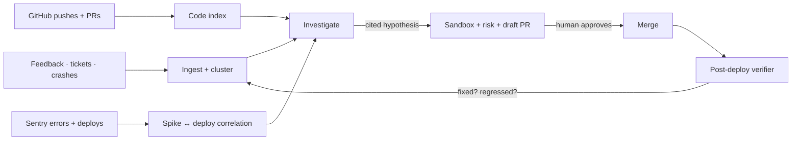

# ⚡ Fusebox

[](https://github.com/kushalsrinivas/fusebox/actions)
[](LICENSE)
[](apps/api)
[](apps/web)

**Your product's flight recorder — and the crew that reads it.**

Fusebox sits on top of your running app and closes the loop most teams do by hand:
user reports come in, Fusebox clusters them, correlates each cluster with errors,
deploys, and source code, names the most likely root cause **with citations**,
then drafts a sandboxed, risk-scored fix for a human to approve. Not a chatbot
over feedback. An evidence pipeline from *what users felt* to *what to merge*.



## The loop, in 30 seconds

Real transcript from a local run (3 crash reports + 1 deploy + 1 Sentry spike):

```
$ curl -X POST $B/v1/clusters/$CID/investigate -H "X-API-Key: $K"
  status: hypothesized  conf: 0.9  sev: 4
  hypothesis: payments-api 1.4.3 (ab12) preceded spike
  citations: [index://demo/apps/payments/checkout.py#L7-L14,
              pil://deployments/…, pil://errors/…]

$ curl -X POST $B/v1/actions/propose … -d '{"diff": "<timeout bump>"}'
  propose: sandbox_passed | branch: fuse/c_0-ab12
  risk: low 0.3 | sandbox: [py_compile: rc=0]

$ curl -X POST $B/v1/actions/$AID/approve …
  approve: approved | dry_run: True
  title: [Fusebox] checkout crash tapping pay: payments-api 1.4.3 (ab12)…
```

Every claim carries receipts: code permalinks, deploy ids, error fingerprints.
No citation, no confidence — the system says `needs_info` instead of guessing.

## What it does today

| Stage | Capability |
|---|---|
| **Ingest** | Feedback API + CSV + Zendesk/Intercom/Slack/Sentry/GitHub webhooks, PII redaction before embedding, per-tenant quotas |
| **Understand** | Incremental repo indexer (AST chunking, hybrid search: cosine + IDF + symbol boost), Sentry error groups, deployment tracking |
| **Investigate** | Feedback clustering, deploy-proximity correlation, knowledge graph with evidence timeline, LangChain + LangGraph agent, confidence math |
| **Act** | Unified-diff validation, secret scan, sandbox checks, regression-risk score with two-approval gate, GitHub draft-PR bot (dry-run without a token) |
| **Learn** | Post-deploy verifier (`verified_fixed` / `regressed` / `inconclusive`), helpfulness signals, feature-demand digest + proposal docs, usage metrics |
| **Operate** | Plans + quotas + Stripe wiring, onboarding wizard, tenant purge across all stores, rate limiting, audit log, one-command replay |

Measured, not vibes: code-search evals **20/20**, investigation evals **15/15 top-1 at 1.000 citation precision**, action-pipeline evals **10/10**, **112 tests** green, load-tested locally (60/60 accepted, p50 13ms).

## Quickstart — first investigation in ~2 minutes, no cloud

```bash
git clone https://github.com/kushalsrinivas/fusebox.git && cd fusebox

# backend (one venv, everything local-first, no Docker required)
python3 -m venv .venv && source .venv/bin/activate
pip install -r apps/api/requirements.txt -r workers/ingest/requirements.txt \
  -r workers/agent/requirements.txt
pip install -e workers/indexer -e workers/correlation -e workers/graph \
  -e workers/action -e workers/verify -e workers/insights \
  -e workers/ingest -e workers/agent -e workers/billing
.venv/bin/python -m uvicorn app.main:app --port 8000 --app-dir apps/api &

# frontend
cd apps/web && npm install && npm run dev &  # http://localhost:3000

# seed the full story: 5 reports, a bad deploy, a Sentry spike
K=dev-key; B=http://localhost:8000
curl -s -X POST $B/v1/onboarding/demo -H "X-API-Key: $K"
open http://localhost:3000/onboarding   # checklist → clusters → investigate → actions
```

Prefer pure API? `POST /v1/repos/sync` a real repo, `POST /v1/clusters/rebuild`,
`POST /v1/clusters/{id}/investigate`, `POST /v1/actions/propose`, then approve.
Full endpoint table: [`docs/API.md`](docs/API.md).

## Repo map

| Path | Role |
|---|---|
| `apps/api` | FastAPI gateway — feedback, repos, telemetry, clusters, actions, billing (`docs/API.md`) |
| `apps/web` | Next.js UI — inbox, code search, errors, clusters, actions, insights, onboarding |
| `workers/indexer` | Repo chunk/embed/search (`make index-demo`, `make eval-code`) |
| `workers/ingest` | Normalize, redact, group feedback |
| `workers/correlation` | Spike → suspect-deploy ranker |
| `workers/graph` | Knowledge graph + evidence timelines |
| `workers/agent` | LangChain + LangGraph investigator, deterministic runner, coder/analyst (`make agent`, `make eval-investigations`) |
| `workers/action` | Diff validate → sandbox → risk → draft PR (`make eval-actions`) |
| `workers/verify` · `workers/insights` · `workers/billing` | Verdicts, feature digest, plans/quotas/Stripe |
| `packages/shared` | Canonical event schema + TS types |
| `docs/` | Connectors, operations runbooks |
| `ARCHITECTURE.md` · `PHASED_PLAN.md` | System design + phased build log (phases 0–6 shipped) |

## Honest limitations

Local-first by design, so know the edges: the sandbox has timeouts and audit
trails but **no network isolation** yet (E2B/Firecracker is the prod swap);
`metrics`/`logs` agent tools need your Grafana/Loki creds to go live;
ClickHouse/Neo4j/Qdrant replace the file-backed stores at scale behind the same
interfaces; the coder needs an LLM key or it refuses to invent code (by design).
Details in [`ARCHITECTURE.md`](ARCHITECTURE.md).

## Contributing

PRs welcome — especially connectors, language chunkers, and eval scenarios.

```bash
make test                  # all suites, per package (required green)
make eval-code eval-investigations eval-actions   # eval gates (must stay above bar)
```

Rules: every agent claim needs a citation path, every new store needs an RLS
policy (`test_rls.py` enforces it), every new behavior needs a test, and
`docs/API.md` stays in sync with the routers.

## License

MIT — see [LICENSE](LICENSE). If Fusebox finds your 3am pager-duty bug, a star
is appreciated. ⭐
